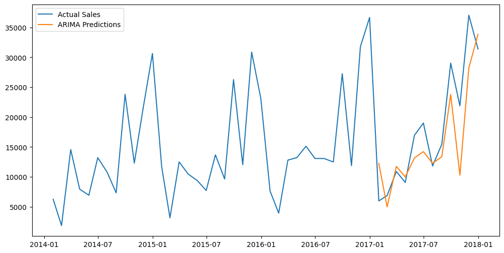

# 🎆 Demand Forecasting: Supply Chain Management Analysis with Python

## 🔧 Project Structure

- `data/stores_sales_forecasting.csv`: The sales dataset
- `data/demand_forecasting_in_supply_chain.py`: Main exploratory and modeling notebook.
  
## 🌟 Background
Perusahaan retail furniture memeiliki data penjualan toko selama tahun 2014 hingga 2017. Data ini terdiri dari 21 fitur dan 2121 baris yang berisi jumlah produk terjual, cabang, keuntungan, diskon, dan rincian lainnya terkait retail furnitur. Dari data ini, perusahaan ingin memprediksi sales pada tahun 2018.

## 🌟 Main goals
Membuat demand forecasting untuk persiapan season penjualan berikutnya yaitu pada tahun 2018.

## 🌟 EDA
### 🔔 Data Preprocessing
Dalam proses Data Preprocessing, hal yang pertama dilakukan adalah mengubah granularitas data dengan ubah menjadi per bulan atau *monthly*. Kemudian dilakukan *agregasi* pada kolom sales, quantity, dan profit untuk melihat rincian per bulan.

Terdapat pola musiman (seasonality) tren pada sales per bulan dan quantity per bulan, dimana pada akhir bulan, jumlah sales dan quantity di awal tahun cenderung rendah lalu mulai meningkat dan puncak kenaikannya adalah saat di akhir tahun. Dan memasuki awal tahun, jumlah sales dan quantity kembali turun dengan signifikan. Sehingga terdapat suatu kecenderungan pola tertentu setiap 12 bulan.

Terlihat bahwa grafik naik turun tanpa kecenderungan pola tertentu. Namun, pada beberapa bulan tertentu, profit dalam keadaan negatif dan dalam jumlah yang cukup besar.

Dari grafik tren sales berdasarkan region, setiap region mengalami profit negatif untuk beberapa periode bulan-tahun tertentu. Terlihat bahwa pada bulan januari tahun 2015 dan pertengahan tahun 2017, sales mencapai nilai terendah pada hampir semua region, kecuali daerah 'west' dan 'east' berturut-turut. Pada bulan juli tahun 2015, sales daerah 'east' mencapai nilai yang rendah sementara ketiga region lainnya mengalami kenaikan. Kedua kondisi ini merupakan salah satu kondisi yang perlu diperhatikan untuk pertimbangan selanjutnya.

Dari grafik tren sales berdasarkan sub-kategori, barang yang perlu diperhatikan adalah “Tables” dan “Bookcases” yang memiliki grafik dengan nilai rendah. Penjualan "Tables" terlihat sangat menurun selama bulan Januari tahun 2015 dan 2018. Kedua kategori barang ini menjadi hal yang perlu diperhatikan dalam pertimbangan lebih lanjut.

## 🌟 Modeling
Selanjutnya, dibuat model forecast menggunakan algoritma Naive forecasting and ARIMA. Kedua algoritma ini tidak mempertimbangkan faktor eksternal, sehingga kolom-kolom seperti lokasi, segmen, dan lainnya dapat dibuang.
### 🌔 Simple Naive Forecast Method

Dari grafik, terlihat bahwa eror yang dihasilkan atau perbandingan nilai prediksi (garis orange) dengan nilai yang sebenarnya (garis biru) cukup besar.
### 🌔 Seasonal Naive Forecast Method

Dari grafik, terlihat bahwa eror yang dihasilkan atau perbandingan nilai prediksi (garis orange) dengan nilai yang sebenarnya (garis biru) kecil.
### 🌔 ARIMA Forecast Method
Dalam algoritma ARIMA, data harus dalam keaadan statitioner, sehingga perlu diperiksa dengan metode ADF Test. Dari tes statistik ini, didapatkan hasil
- ADF Statistic = -4.6
- p-value = 0.00005
Nilai p-value < 0.5, sehingga data termasuk stationer.

Dari grafik, terlihat bahwa eror yang dihasilkan atau perbandingan nilai prediksi (garis orange) dengan nilai yang sebenarnya (garis biru) cukup kecil.

### 🌕 Perbandingan ketiga Forecast method 

| Evaluation Metric | Simple Naive  | Seasonal Naive | ARIMA (13,0,5) |
|-------------------|---------------| ---------------|----------------|
| RMSE              | 11521.51      | 4473.38        | 5269.74        |
| MAE               | 8315.92       | 3747.02        | 4103.16        |

Dari ketiga forecast model, yang memiliki eror paling kecil adalah *Seasonal Naive Forecast* sehingga disimpulkan model ini adalah model terbaik dari ketiganya.

## 🌟 Prediction and Recommendation
Dengan menggunakan model Seasonal Naive Forecast, dilakukan prediksi sales pada tahun 2018 berdasarkan data yang ada.

Dari hasil prediksi, terlihat bahwa tren akan dimulai dengan nilai yang cukup rendah, lalu semakin naik seiring bertambahnya waktu. Dalam hal ini, tindakan yang dapat dilakukan adalah meminimalisir atau mengurangi produksi di awal tahun dikarenakan penjualan diprediksi rendah. Lalu, semakin menuju pertengahan dan akhir tahun, produksi dapat ditambah secara bertahap karena tren diprediksi naik secara signifikan menuju akhir tahun.

Dengan demand yang cenderung bertambah naik, perlu diperlukan pemeriksaan demand planning.
- Apakah ruang warehouse memadai untuk mengakomodasikan perkembangan bisnis? Jika tidak, maka perlu memperluas atau menyewa gudang.
- Apakah tenaga kerja yang ada sudah cukup untuk memenuhi demand? Dapat dilakukan perekrutan karyawan baru.
